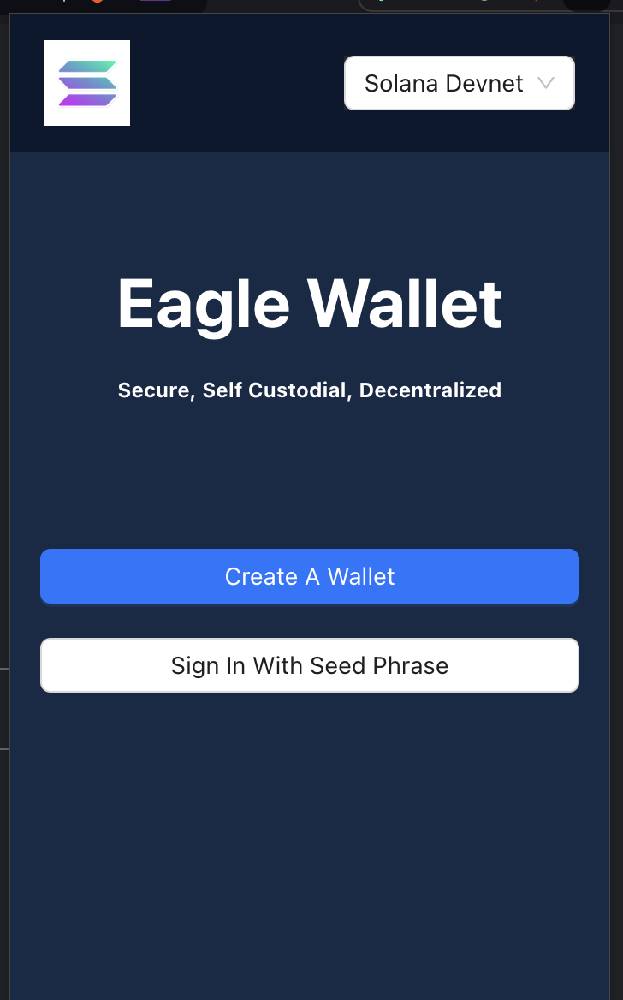
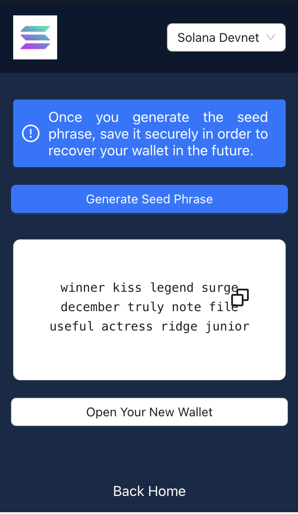
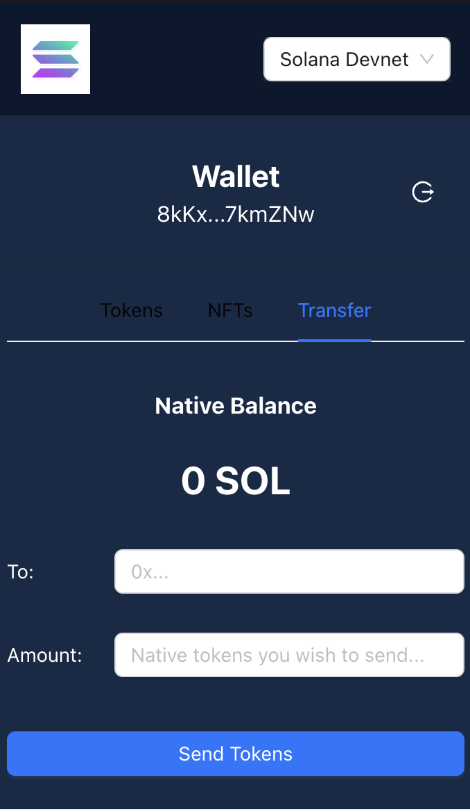
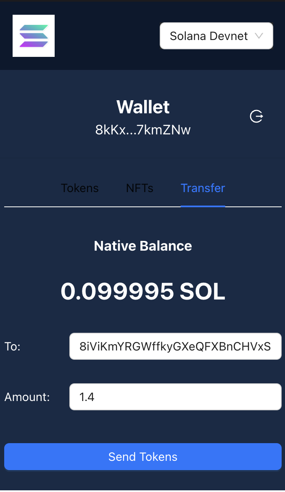
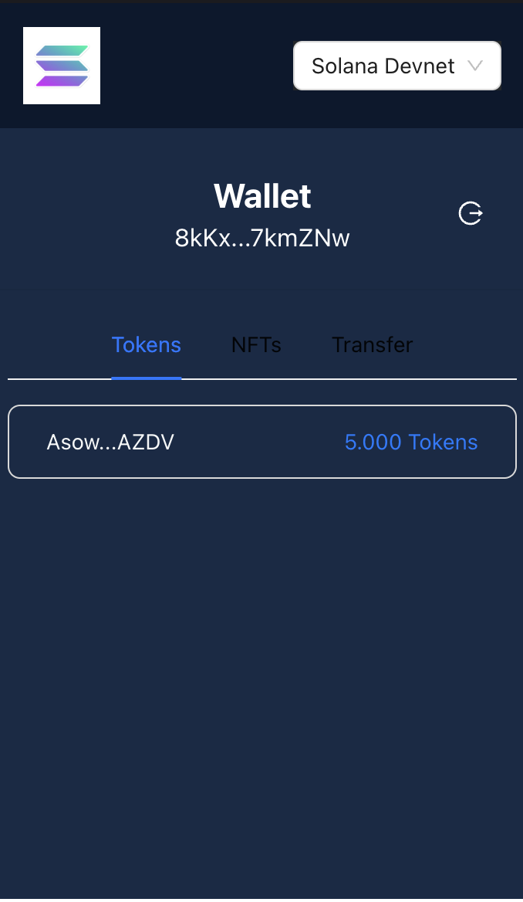
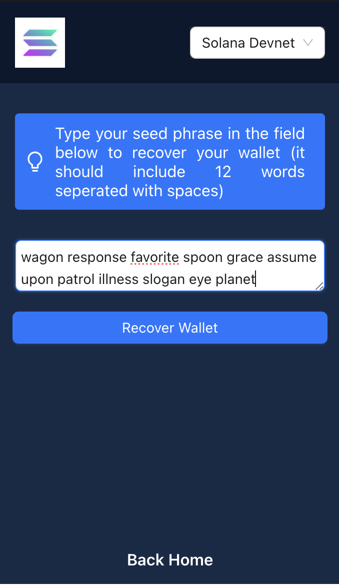

# Solana Wallet Application

## Introduction
This Solana wallet application allows you to manage SOL tokens and interact with the Solana blockchain. It offers key functionalities such as generating a new wallet, recovering wallets from mnemonic phrases, sending SOL, retrieving token balances, and more.

## Feature Summary
| Feature              | Description                                                   |
|----------------------|---------------------------------------------------------------|
| Generate Mnemonic     | Generates a 12-word BIP39 mnemonic phrase, derives the corresponding seed, saves the keypair, and displays the public key. phrase.                   |
| Recover Keypair       | Recovers a keypair (public and private keys) and a seed from an existing BIP39 mnemonic phrase.           |
| Keypair Generation    | Generates a Solana keypair (both public and private keys) from the derived seed.          |
| Send SOL (lamports)   | Send SOL to a recipient address by signing an outgoing transaction with the wallet's private key.    |
| Public Key Display    | Retrieves and displays the public key associated with the locally stored keypair.  |
| Get Balance           | Retrieves the balance of the wallet by its public key, in both SOL and lamports.    |
| Get Tokens            | Retrieves the SPL tokens (Solana Program Library tokens) associated with the wallet’s public key.            |
| Sign Up with Seed Phrase | Allows users to sign up and recover their wallet using an existing BIP39 seed phrase. |

# How to Run
## Prerequisites
- Node.js (for the front-end and any JavaScript-related parts).
- Rust (if interacting with the Solana blockchain in Rust).

# Cloning the Repository
To get started, clone the repository to your local machine using Git:


```
git clone https://github.com/Parikalp-Bhardwaj/decentralized-wallet-rust-extension.git

cd ./decentralized-wallet-rust-extension
```

## How to Run
Once you have cloned the repository, follow the steps below to run the application:

## 1. Install Dependencies
   Install the necessary dependencies using npm:

```bash 
npm install

```

## 2. Start the Application
  Start the front-end of the application using npm:

```bash 
npm install -g serve 
serve -s build
```

This will start the front-end application at http://localhost:3000 by default.

## 3. Back-end Setup (Rust)
If the back-end involves Rust for Solana interactions, follow these steps:

Build the Rust project:

```bash
cargo build 
```

Start backend

```bash
cargo run
```


## Wallet Dashboard


### Creates a new random BIP39 mnemonic phrase.


### Retrieves the balance (in SOL and lamports) by public key.


###  Sends SOL to a recipient address by signing a transaction.


### Retrieves tokens associated with a Solana account. 


### Users to sign up and recover their wallet using an existing BIP39 seed phrase

